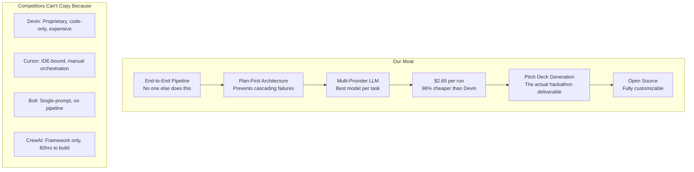

# 💰 Cost Analysis & Competitive Positioning

## Part 1: Cost Per Hackathon Run

### LLM Token Estimates (Single Full Pipeline Run)

Each phase has a predictable token footprint based on the prompt sizes and expected outputs:

| Phase | Agent | Model | Input Tokens | Output Tokens |
|-------|-------|-------|-------------|--------------|
| 0 - Clarify | Clarification | Claude Sonnet 4 | ~2,000 | ~1,000 |
| 0 - Synthesize | Clarification | Claude Sonnet 4 | ~3,500 | ~2,000 |
| 1 - Query Gen | Research | Gemini 2.5 Flash | ~1,000 | ~500 |
| 1 - Synthesis | Research | Gemini 2.5 Flash | ~18,000 | ~5,000 |
| 1 - Embeddings | Knowledge Base | Gemini Embed | ~12,000 | — |
| 2 - PRD | Architect | Claude Sonnet 4 | ~12,000 | ~6,000 |
| 2 - Tasks | Planner | Claude Sonnet 4 | ~8,000 | ~4,000 |
| 2 - Recovery | Planner | Claude Sonnet 4 | ~4,000 | ~2,000 |
| 3 - Code (×12) | Coder | Claude Sonnet 4 | ~84,000 | ~60,000 |
| 3 - Review (×2) | Reviewer | Gemini 2.5 Pro | ~24,000 | ~4,000 |
| 3 - Revision (×6) | Coder | Claude Sonnet 4 | ~36,000 | ~24,000 |
| 3 - Deploy | Deployer | Claude Haiku 3.5 | ~3,000 | ~2,000 |
| 4 - Pitch | Pitch | Claude Sonnet 4 | ~14,000 | ~4,000 |
| 4 - Present | Presentation | Kimi k2 | ~6,000 | ~2,000 |
| **TOTALS** | | | **~227,500** | **~116,500** |

### Cost Breakdown by Provider

#### 🟣 Anthropic (Claude Sonnet 4) — $3.00 / $15.00 per 1M tokens

| Usage | Tokens | Cost |
|-------|--------|------|
| Input | ~163,500 | $0.49 |
| Output | ~103,000 | $1.55 |
| **Subtotal** | | **$2.04** |

#### 🟣 Anthropic (Claude Haiku 3.5) — $0.80 / $4.00 per 1M tokens

| Usage | Tokens | Cost |
|-------|--------|------|
| Input | ~3,000 | $0.002 |
| Output | ~2,000 | $0.008 |
| **Subtotal** | | **$0.01** |

#### 🔵 Google (Gemini 2.5 Flash) — $0.30 / $2.50 per 1M tokens

| Usage | Tokens | Cost |
|-------|--------|------|
| Input | ~19,000 | $0.006 |
| Output | ~5,500 | $0.014 |
| **Subtotal** | | **$0.02** |

#### 🔵 Google (Gemini 2.5 Pro) — $1.25 / $10.00 per 1M tokens

| Usage | Tokens | Cost |
|-------|--------|------|
| Input | ~24,000 | $0.03 |
| Output | ~4,000 | $0.04 |
| **Subtotal** | | **$0.07** |

#### 🔵 Google (Embeddings) — $0.0001 per 1K tokens

| Usage | Tokens | Cost |
|-------|--------|------|
| Embed | ~12,000 | $0.001 |
| **Subtotal** | | **~$0.00** |

#### 🟢 Moonshot (Kimi k2) — ~$0.95 / ~$2.00 per 1M tokens

| Usage | Tokens | Cost |
|-------|--------|------|
| Input | ~6,000 | $0.006 |
| Output | ~2,000 | $0.004 |
| **Subtotal** | | **$0.01** |

---

### 📊 Total LLM Cost Per Hackathon

| Provider | Cost |
|----------|------|
| Anthropic (Claude Sonnet 4) | $2.04 |
| Anthropic (Claude Haiku 3.5) | $0.01 |
| Google (Gemini 2.5 Flash) | $0.02 |
| Google (Gemini 2.5 Pro) | $0.07 |
| Google (Embeddings) | ~$0.00 |
| Moonshot (Kimi k2) | $0.01 |
| **Total LLM** | **$2.15** |

### External Service Costs

| Service | Cost | Notes |
|---------|------|-------|
| Gamma API (Pro plan) | ~$16/mo | Shared across unlimited runs per month |
| Railway (deployment) | ~$5/mo | Free tier includes $5 credit |
| Docker | $0 | Runs locally |
| DuckDuckGo Search | $0 | No API key required |
| ChromaDB | $0 | Local, open-source |
| **Per-run share** | **~$0** | Fixed monthly costs, not per-run |

### 🎯 Grand Total Per Hackathon

| Category | Cost |
|----------|------|
| LLM API tokens | **$2.15** |
| External services (amortized) | ~$0.50* |
| **TOTAL** | **~$2.65** |

> *Assuming ~5 hackathons/month with $21/mo fixed costs

> [!TIP]
> **With Batch API (50% discount on Anthropic):** Total drops to **~$1.60**
> **With Prompt Caching (90% on repeated prompts):** Total drops to **~$1.20**

---

## Part 2: Competitor Analysis

### Direct Competitors

| Feature | **Our Pipeline** | **Devin** (Cognition) | **Cursor** | **Bolt.new** | **CrewAI DIY** |
|---------|-----------------|----------------------|------------|-------------|---------------|
| **Type** | Autonomous end-to-end pipeline | Autonomous coding agent | AI-enhanced IDE | Prompt-to-app | Multi-agent framework |
| **Scope** | Research → Code → Deploy → Pitch | Code only | Code only | Code + preview | Whatever you build |
| **Entry Price** | **~$2.65/run** | $20/mo + $2.25/ACU | $20/mo | $25/mo | Free (+ LLM costs) |
| **Cost for hackathon** | **~$2.65** | **~$50-150** | **~$20+** | **~$25+** | **~$3-8** (DIY) |
| **Research phase** | ✅ Automated | ❌ Manual | ❌ Manual | ❌ Manual | ⚠️ If you build it |
| **Architecture/PRD** | ✅ Automated | ⚠️ Partial | ❌ Manual | ❌ None | ⚠️ If you build it |
| **Code generation** | ✅ Multi-file, task-based | ✅ Strong | ✅ Strong | ✅ Single-file focus | ⚠️ Basic |
| **Sandboxed review** | ✅ Docker | ✅ Built-in | ❌ None | ✅ Browser sandbox | ❌ None |
| **Self-correction** | ✅ 3-retry loop | ✅ Yes | ❌ Manual | ⚠️ Limited | ❌ Must build |
| **Auto-deployment** | ✅ Railway | ❌ Manual | ❌ Manual | ✅ Netlify | ❌ Must build |
| **Pitch deck** | ✅ Gamma API (7 slides) | ❌ None | ❌ None | ❌ None | ❌ None |
| **Interactive brief** | ✅ Asks questions first | ❌ Takes instructions | ❌ Takes instructions | ❌ Takes prompt | ❌ N/A |
| **Multi-LLM** | ✅ 3 providers, 6 models | ❌ Single model | ❌ Pick one | ❌ Single model | ⚠️ DIY config |
| **Open source** | ✅ Fully | ❌ Proprietary | ❌ Proprietary | ❌ Proprietary | ✅ Framework only |

### Detailed Competitor Profiles

#### 1. **Devin** (Cognition AI) — $20/mo + $2.25/ACU
- **What it is:** Autonomous software engineer agent
- **Strengths:** Strong at isolated coding tasks, can browse web, run terminal, debug
- **Weaknesses:**
  - Only handles code — no research, no pitch, no deployment
  - Expensive at scale: a complex hackathon project easily burns 20-50 ACUs = **$45-$112**
  - No hackathon-specific workflow (no PRD, no pitch deck)
  - Single model (proprietary), no multi-provider flexibility
  - Closed source

#### 2. **Cursor** — $20-200/mo
- **What it is:** AI-enhanced code editor (IDE)
- **Strengths:** Excellent UX, Tab completions, inline code generation
- **Weaknesses:**
  - It's an IDE, not a pipeline — still requires a human to orchestrate
  - No research, no architecture, no deployment, no pitch
  - You're paying for a tool, not an outcome
  - Monthly subscription regardless of usage

#### 3. **Bolt.new** — $25/mo
- **What it is:** Prompt-to-app generator with browser preview
- **Strengths:** Instant visual feedback, good for simple apps, Netlify deploy
- **Weaknesses:**
  - Single-prompt → single-app paradigm (no plan-first methodology)
  - Token-limited (10M/mo on Pro)
  - No research, no competitive analysis, no pitch deck
  - Can't handle complex multi-service architectures
  - No self-correction loop for code quality

#### 4. **CrewAI / LangGraph DIY** — Free framework + LLM costs
- **What it is:** Multi-agent framework you build yourself
- **Strengths:** Flexible, open-source, proven patterns
- **Weaknesses:**
  - You must build EVERYTHING yourself (that's what we did!)
  - No pre-built hackathon pipeline
  - No pitch generation, no deployment automation
  - Hours/days of development to reach parity with our pipeline
  - Estimated cost to build from scratch: **40-80 hours of engineering time**

#### 5. **Windsurf** — $20-200/mo
- **What it is:** AI-powered IDE with "Cascade" agent
- **Strengths:** Strong codebase awareness, context management
- **Weaknesses:** Same as Cursor — it's an IDE tool, not an end-to-end pipeline

---

## Part 3: Our USP (Unique Selling Propositions)

### 🏆 Primary USP: "The Only End-to-End Hackathon-in-a-Box"

> **No other tool on the market takes a raw idea and produces a deployed app + investor pitch deck in one automated pipeline.**

Every competitor handles at most 1-2 phases. Our pipeline handles all 5:

```
Idea → Research → Architecture → Code → Deploy → Pitch Deck
 ↑        ↑          ↑            ↑        ↑         ↑
Only us   Only us    Only us      Many     Some      Only us
```

### 💡 Secondary USPs

| USP | What It Means | Why It Matters |
|-----|---------------|----------------|
| **Plan-First (Mise en Place)** | Research and architecture BEFORE any code | Competitors jump straight to coding, causing 37.5% error rates (per the research paper). We prevent cascading failures. |
| **Multi-Provider Intelligence** | Best model for each task | Claude codes, Gemini reviews, Kimi designs. Competitors lock you into one model. We pick winners per task. |
| **Interactive Clarification** | Asks questions before building | Competitors assume. We ask. This eliminates the #1 failure mode: building the wrong thing. |
| **Self-Correcting Code Loop** | Docker sandbox + 3 retry cycles | Code is tested in isolation before deployment. Devin does this; Cursor/Bolt don't. |
| **Hackathon-Specific Pitch** | 7-slide VC framework via Gamma API | No competitor generates a pitch deck. This is the actual winning deliverable at hackathons. |
| **$2.65 Per Run** | 96% cheaper than Devin for the same scope | Devin would cost $50-150 for equivalent work. We cost $2.65. |
| **Open Source** | Full control, full customization | Devin, Cursor, Bolt are all proprietary. We're fully open. |
| **Offline Capable** | Docker + Ollama fallback (optional) | Swap Anthropic for Ollama in config.py for fully offline operation. |

### 🎯 Elevator Pitch

> **"We're the autonomous pipeline that turns a hackathon idea into a deployed app and pitch deck for $2.65 — while Devin costs $100+ and only handles the code."**

### 📈 Competitive Moat



---

## Cost Sensitivity Analysis

### What If We Run 10 Hackathons/Month?

| Item | 1 run | 5 runs | 10 runs |
|------|-------|--------|---------|
| LLM tokens | $2.15 | $10.75 | $21.50 |
| Gamma Pro (monthly) | $16 | $16 | $16 |
| Railway (monthly) | $5 | $5 | $5 |
| **Total** | **$23.15** | **$31.75** | **$42.50** |
| **Per-run cost** | **$23.15** | **$6.35** | **$4.25** |

> The fixed monthly costs ($21) amortize quickly. By the 5th run, you're at $6.35/run.

### Break-Even vs Devin

If Devin costs ~$75/hackathon (conservative estimate):
- **Break-even: 1st run** — we're cheaper from day one
- **5 runs: Save $343** ($375 Devin vs $31.75 ours)
- **10 runs: Save $707** ($750 Devin vs $42.50 ours)
